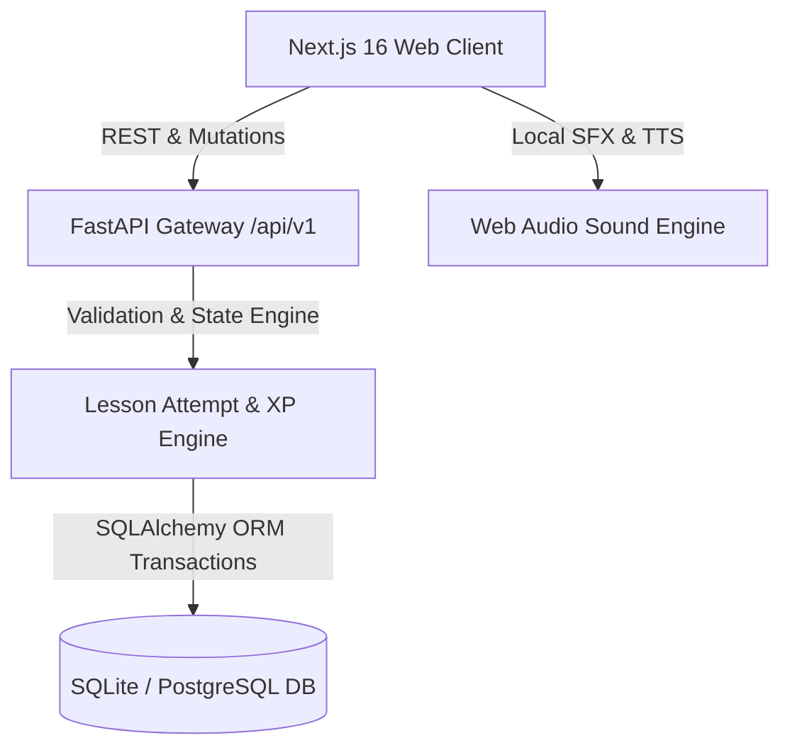

# Duolingo Fullstack Clone 🦉

A production-grade, 1:1 tactile replication of Duolingo built with **FastAPI**, **Next.js 16 (Turbopack)**, **Tailwind CSS v4**, **SQLAlchemy 2.0**, and **Zustand**.

---

## Architecture Overview



### Core Features

1. **Learning Path & Sine-Wave Tree (`/learn`)**:
   - Visual sine-wave path (`[0, 45, 75, 45, 0, -45, -75, -45]` px).
   - Dynamic states: Gold completed nodes, green active node with bouncing `START` tooltip and SVG progress ring, and locked nodes.
   - Interactive Unit Banners with 3D Guidebook modals.

2. **Full Gamified Lesson Loop (`/lesson/[lessonId]`)**:
   - 5 Exercise Types: Multiple Choice (3D vertical cards), Translate (word bank with recessed placeholder slots), Match Pairs (Fisher-Yates decoupled shuffle with non-adjacent guard), Fill in the Blank, and Type the Answer.
   - Immediate feedback drawer (120px tall fixed bottom bar with `SKIP`, 3D `CHECK`, and animated Green/Red results).
   - Spaced repetition retry queue: failed exercises automatically re-queue at the end of the lesson.
   - Global keyboard shortcuts: `1-4` for option choice, `Enter` for Check / Continue, `Backspace` for word removal.

3. **Practice Hub & Mistakes Review (`/practice`)**:
   - Dedicated review session (`/practice/mistakes/start`) targeting only exercises the learner answered incorrectly.
   - Zero heart penalty in practice mode.
   - Restores `+1` heart (up to 5) and awards `+5 XP` upon completion.

4. **Gamification & Economy**:
   - Time-zone aware streak counter with `/dev/advance-day` simulation.
   - Lazy heart regeneration (1 heart every 5 hours without cron pollers).
   - Bronze League leaderboard tournament with 29 seeded competitors.
   - Gem economy and instant 350-gem heart refills.

5. **Audio & Dual Themes**:
   - Authentic synthesized audio effects (`correct.mp3`, `incorrect.mp3`, `complete.mp3`, `tap.mp3`).
   - Full Light (`#FFFFFF`, `#E5E5E5`) and Dark (`#131F24`, `#18272F`, `#263843`) theme design system.

---

## Project Structure

```
duolingo-clone/
├── backend/
│   ├── app/
│   │   ├── core/           # Database config, app clock, settings
│   │   ├── models/         # SQLAlchemy 2.0 ORM models (User, Course, Attempt, Gamification)
│   │   ├── schemas/        # Pydantic v2 validation schemas
│   │   ├── routers/        # Domain-driven REST endpoints (v1_user, v1_lessons, etc.)
│   │   └── services/       # Core business logic (LessonEngine, HeartService, StreakService, XPService)
│   ├── seed/               # Curriculum content and bot seeding scripts
│   └── tests/              # Pytest backend test suite (20 tests)
├── frontend/
│   ├── public/sounds/      # Synthesized audio sound effects
│   └── src/
│       ├── app/            # Next.js App Router pages (learn, lesson, practice, leaderboard, etc.)
│       ├── components/     # Reusable layout and 3D tactile UI components
│       ├── features/       # Feature slices (lesson store & exercise components, path tree)
│       ├── hooks/          # TanStack React Query hooks
│       └── lib/            # API fetch client and sound player
```

---

## Quickstart Guide

### 1. Backend Setup
```bash
cd backend
python3 -m venv .venv
source .venv/bin/activate
pip install -r requirements.txt

# Run migrations & seed data
python -m seed.seed

# Start FastAPI development server
uvicorn app.main:app --reload --port 8000
```
Swagger API docs available at: `http://localhost:8000/api/v1/docs`

### 2. Frontend Setup
```bash
cd frontend
npm install
npm run dev
```
Web application available at: `http://localhost:3000`

---

## Running Tests

### Backend Tests (Pytest)
```bash
cd backend
./.venv/bin/pytest -v
```

### Frontend Production Build
```bash
cd frontend
npm run build
```

---

## API Endpoints Reference

| Method | Endpoint | Description |
| :--- | :--- | :--- |
| `GET` | `/api/v1/me` | Fetch learner profile, hearts, streak, and daily goal |
| `PATCH`| `/api/v1/me/settings` | Update daily goal XP, sound effects, or dark mode |
| `GET` | `/api/v1/path` | Get curriculum units, skills, and dynamic progression |
| `POST`| `/api/v1/lessons/{id}/start` | Start standard lesson session |
| `POST`| `/api/v1/practice/start` | Start general practice session |
| `GET` | `/api/v1/practice/summary` | Get count of active mistakes and review stats |
| `POST`| `/api/v1/practice/mistakes/start` | Start targeted mistakes review session |
| `POST`| `/api/v1/attempts/{id}/answer` | Submit answer & receive instant validation |
| `POST`| `/api/v1/attempts/{id}/complete` | Finish attempt, calculate XP, and advance streak |
| `POST`| `/api/v1/hearts/refill` | Refill 5 hearts for 350 gems |
| `GET` | `/api/v1/leaderboard` | Get weekly league standings |
| `POST`| `/api/v1/dev/advance-day` | Simulate time-machine day rollover |
| `POST`| `/api/v1/dev/reset` | Reset database to clean demo state |
